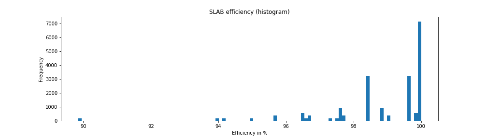
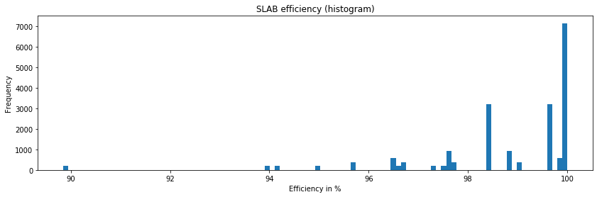

SLAB benchmark analysis
=======================

In this notebook, I retrieve the results from a
`lkp-tests <https://github.com/intel/lkp-tests>`__ benchmark and process
the ``slabinfo`` file in it.

**Benchmark name:**
``fsmark-1hdd-1HDD-9B-ext4-1x-16d-256fpd-32t-fsyncBeforeClose-400M.yaml``

**NOTE:** The specs of the VM (used to run the benchmark) is attached at
the end of this notebook.

How the efficiency was calculated
---------------------------------

The efficiency means how much space the used objects need in principle,
divided by the real memory usage.

   efficiency_in_percent = (num_objs \* objsize \* 100) / (num_slabs \*
   (page_size \* 2 \*\* order))

The efficiency is calculated individually for each slab cache
seperatedly in time.

Taken from
`linux/tools/vm/slabinfo.c <https://github.com/torvalds/linux/blob/8a8c600de5dc1d9a7f4b83269fddc80ebd3dd045/tools/vm/slabinfo.c#L644>`__

Install instructions
--------------------

.. code:: bash

   # or via ssh
   git clone --depth 1 https://github.com/intel/lkp-tests

   cd lkp-tests
   # If this fails, try another OS
   sudo make install

   cd ..

   # Adapt the lkp-tests/hosts/YOUR_HOSTNAME file to have a `hdd_partition` section
   # You can use the `create-block-device.sh` script provided in the root of this repository 

   # This MUST be done after EVERY change to the "lkp-tests/hosts/YOUR_HOSTNAME" file!
   lkp split lkp-tests/jobs/fsmark-1hdd.yaml

   sudo lkp install fsmark-1hdd-1HDD-9B-ext4-1x-16d-256fpd-32t-fsyncBeforeClose-400M.yaml
   sudo lkp run fsmark-1hdd-1HDD-9B-ext4-1x-16d-256fpd-32t-fsyncBeforeClose-400M.yaml

Result
------

   Benchmark

This is a histogram of the efficiencies of ALL slab caches over the
whole time.

**NOTE** this is not a weighted histogram, i.e. a small slab cache with
100% efficiency has the same weight as a very big slab cache with only
50% efficiency. So this histogram should be taken with a grain of salt

.. code:: ipython3

    # Convert this notebook
    !jupyter nbconvert --to rst process.ipynb

.. parsed-literal::

    [NbConvertApp] Converting notebook process.ipynb to rst
    [NbConvertApp] Support files will be in process_files/
    [NbConvertApp] Making directory process_files
    [NbConvertApp] Writing 10706 bytes to process.rst

Retrieve lkp-tests result folder from VM
----------------------------------------

.. code:: ipython3

    HOST="david-vm-ubuntu"
    !mkdir -p results
    !mv results/result results/result_`(date +%s)`
    !ssh {HOST} 'cd projects; echo "a" | sudo -S ./save_slab_orders.sh'
    !scp -r -q {HOST}:projects/result results
    !ssh {HOST} 'ls -l projects/result | cut -d ">" -f 2' > results/result/job

Parse results
-------------

.. code:: ipython3

    import os
    
    FOLDER = 'results/result'
    FILE = FOLDER + '/slabinfo'
    IMAGE_FOLDER = 'images'
    
    os.makedirs(IMAGE_FOLDER, exist_ok=True)
    
    with open(FOLDER + '/job') as f:
        job_name = f.read().strip()
    
    with open(FILE) as f:
        slab_info = f.read().splitlines()
    
    with open(FOLDER + '/orders') as f:
        orders = {x.split()[0]: int(x.split()[1]) for x in f.readlines()}
    
    # Extracted from `slabinfo`
    headers = [
        'time',
        'name',
        'active_objs',
        'num_objs',
        'objsize',
        'objperslab',
        'pagesperslab',
        'tunables',
        'limit',
        'batchcount',
        'sharedfactor',
        'slabdata',
        'active_slabs',
        'num_slabs',
        'sharedavail',
    ]
    
    def convert_num(x):
        try:
            return int(x)
        except:
            return x
    
    def parse_slabinfo_log(lkp_tests_slab_info):
        data = []
        current = None
        
        for line in slab_info:
            if line.startswith('time:'):
                current = int(line.split()[-1])
                continue
            if line.startswith('# name'):
                continue
            if line.startswith('slabinfo'):
                continue
    
            l = [current] + [convert_num(x.strip()) for x in line.split() if x is not ':']
            assert len(l) == len(headers)
            data.append(l)
        return data
    
    data = parse_slabinfo_log(slab_info)

Create visualizations
---------------------

.. code:: ipython3

    %matplotlib inline
    import pandas as pd
    import matplotlib.pyplot as plt
    
    df = pd.DataFrame(data, columns=headers)
    
    #df = df[df.name == 'dentry']
    
    df['order'] = df.name.apply(lambda x: orders.get(x, 0))
    df['page_size'] = 4096
    
    df['active_vs_num'] = df.active_objs / df.num_objs
    
    df['ef'] = df.num_objs * df.objsize * 100 / (df.num_slabs * (df.page_size * 2 ** df.order))
    
    ax = df.ef.plot(kind='hist', bins=100, figsize=(14, 4))
    
    ax.set_title(f'SLAB efficiency (histogram)')
    ax.set_xlabel('Efficiency in %')
    
    def sanitize_name(x):
        return x.replace('/', '___')
    
    plt.savefig(f'{IMAGE_FOLDER}/{sanitize_name(job_name)}.png')
    
    duration_in_seconds = max(df.time.values) - min(df.time.values)
    print(f'Test took: {duration_in_seconds / 60:.2f} minutes')

.. parsed-literal::

    Test took: 3.13 minutes

.. code:: ipython3

    job_name

.. parsed-literal::

    '/lkp/result/fsmark/1HDD-9B-ext4-1x-16d-256fpd-32t-fsyncBeforeClose-400M/david-vm-ubuntu/ubuntu/x86_64-rhel-7.6/gcc-7/5.0.0-31-generic/2'

VM specs
--------

**uname -a**: Linux david-vm-ubuntu 5.0.0-31-generic #33~18.04.1-Ubuntu
SMP Tue Oct 1 10:20:39 UTC 2019 x86_64 x86_64 x86_64 GNU/Linux

.. raw:: html

   <pre>
   Name:                        Ubuntu
   Groups:                      /
   Guest OS:                    Ubuntu (64-bit)
   UUID:                        517d91b9-e324-470f-b1f3-dcaf40f3ab01
   Config file:                 /home/dgengenbach/VirtualBox VMs/Ubuntu/Ubuntu.vbox
   Snapshot folder:             /home/dgengenbach/VirtualBox VMs/Ubuntu/Snapshots
   Log folder:                  /home/dgengenbach/VirtualBox VMs/Ubuntu/Logs
   Hardware UUID:               517d91b9-e324-470f-b1f3-dcaf40f3ab01
   Memory size                  16384MB
   Page Fusion:                 disabled
   VRAM size:                   16MB
   CPU exec cap:                100%
   HPET:                        disabled
   CPUProfile:                  host
   Chipset:                     piix3
   Firmware:                    BIOS
   Number of CPUs:              4
   PAE:                         disabled
   Long Mode:                   enabled
   Triple Fault Reset:          disabled
   APIC:                        enabled
   X2APIC:                      enabled
   Nested VT-x/AMD-V:           disabled
   CPUID Portability Level:     0
   CPUID overrides:             None
   Boot menu mode:              message and menu
   Boot Device 1:               Floppy
   Boot Device 2:               DVD
   Boot Device 3:               HardDisk
   Boot Device 4:               Not Assigned
   ACPI:                        enabled
   IOAPIC:                      enabled
   BIOS APIC mode:              APIC
   Time offset:                 0ms
   RTC:                         UTC
   Hardw. virt.ext:             enabled
   Nested Paging:               enabled
   Large Pages:                 disabled
   VT-x VPID:                   enabled
   VT-x unr. exec.:             enabled
   Paravirt. Provider:          Default
   Effective Paravirt. Prov.:   KVM
   State:                       running (since 2019-10-10T10:10:24.186000000)
   Monitor count:               1
   3D Acceleration:             disabled
   2D Video Acceleration:       disabled
   Teleporter Enabled:          disabled
   Teleporter Port:             0
   Teleporter Address:          
   Teleporter Password:         
   Tracing Enabled:             disabled
   Allow Tracing to Access VM:  disabled
   Tracing Configuration:       
   Autostart Enabled:           disabled
   Autostart Delay:             0
   Default Frontend:            
   Storage Controller Name (0):            IDE
   Storage Controller Type (0):            PIIX4
   Storage Controller Instance Number (0): 0
   Storage Controller Max Port Count (0):  2
   Storage Controller Port Count (0):      2
   Storage Controller Bootable (0):        on
   Storage Controller Name (1):            SATA
   Storage Controller Type (1):            IntelAhci
   Storage Controller Instance Number (1): 0
   Storage Controller Max Port Count (1):  30
   Storage Controller Port Count (1):      1
   Storage Controller Bootable (1):        on
   IDE (1, 0): Empty
   SATA (0, 0): /home/dgengenbach/VirtualBox VMs/Ubuntu/Ubuntu.vdi (UUID: 466e9eb9-b4f4-4088-9a6f-fc60775b5c8c)
   NIC 1:                       MAC: 080027CA5503, Attachment: Bridged Interface 'eno1', Cable connected: on, Trace: off (file: none), Type: 82540EM, Reported speed: 0 Mbps, Boot priority: 0, Promisc Policy: deny, Bandwidth group: none
   NIC 2:                       disabled
   NIC 3:                       disabled
   NIC 4:                       disabled
   NIC 5:                       disabled
   NIC 6:                       disabled
   NIC 7:                       disabled
   NIC 8:                       disabled
   Pointing Device:             USB Tablet
   Keyboard Device:             PS/2 Keyboard
   UART 1:                      disabled
   UART 2:                      disabled
   UART 3:                      disabled
   UART 4:                      disabled
   LPT 1:                       disabled
   LPT 2:                       disabled
   Audio:                       enabled (Driver: PulseAudio, Controller: AC97, Codec: AD1980)
   Audio playback:              enabled
   Audio capture:               disabled
   Clipboard Mode:              disabled
   Drag and drop Mode:          disabled
   Session name:                headless
   Video mode:                  800x600x32 at 0,0 enabled
   VRDE:                        disabled
   OHCI USB:                    enabled
   EHCI USB:                    disabled
   xHCI USB:                    disabled

   USB Device Filters:

   <none>

   Available remote USB devices:

   <none>

   Currently Attached USB Devices:

   <none>

   Bandwidth groups:  <none>

   Shared folders:<none>

   VRDE Connection:             not active
   Clients so far:              0

   Capturing:                   not active
   Capture audio:               not active
   Capture screens:             0
   Capture file:                /home/dgengenbach/VirtualBox VMs/Ubuntu/Ubuntu.webm
   Capture dimensions:          1024x768
   Capture rate:                512kbps
   Capture FPS:                 25kbps
   Capture options:             

   Guest:

   Configured memory balloon size: 0MB
   OS type:                     Linux26_64
   Additions run level:         1
   Additions version            6.0.6_KernelUbuntu r129722

   Guest Facilities:

   Facility "VirtualBox Base Driver": active/running (last update: 2019/10/10 10:10:31 UTC)
   Facility "Seamless Mode": not active (last update: 2019/10/10 10:10:31 UTC)
   Facility "Graphics Mode": not active (last update: 2019/10/10 10:10:31 UTC)
   </pre>
