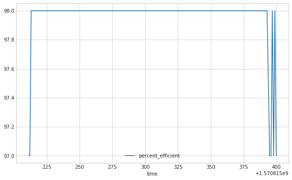

SLAB benchmark analysis
=======================

In this notebook, I retrieve the results from a
`lkp-tests <https://github.com/intel/lkp-tests>`__ benchmark and process
the ``slabinfo`` file in it.

The raw benchmark result data resides in
`result\_[157081564] <results/result_%5B1570815643%5D/>`__.

**NOTE:** The specs of the used VM are attached at the end of this
notebook.

**Benchmark name:**
``fsmark-1hdd-1HDD-9B-ext4-1x-16d-256fpd-32t-fsyncBeforeClose-400M.yaml``

How the efficiency was calculated
---------------------------------

The efficiency means how much space the used objects need in principle,
divided by the real memory usage.

    efficiency\_in\_percent = (num\_objs \* objsize \* 100) /
    (num\_slabs \* (page\_size \* 2 \*\* order))

The efficiency is calculated individually for each slab cache
seperatedly in time.

Taken from
`linux/tools/vm/slabinfo.c <https://github.com/torvalds/linux/blob/8a8c600de5dc1d9a7f4b83269fddc80ebd3dd045/tools/vm/slabinfo.c#L644>`__

Install instructions
--------------------

.. code:: bash

    # or via ssh
    git clone --depth 1 https://github.com/intel/lkp-tests

    cd lkp-tests
    # If this fails, try another OS
    sudo make install

    cd ..

    # Adapt the lkp-tests/hosts/YOUR_HOSTNAME file to have a `hdd_partition` section
    # You can use the `create-block-device.sh` script provided in the root of this repository 

    # This MUST be done after EVERY change to the "lkp-tests/hosts/YOUR_HOSTNAME" file!
    lkp split lkp-tests/jobs/fsmark-1hdd.yaml

    sudo lkp install fsmark-1hdd-1HDD-9B-ext4-1x-16d-256fpd-32t-fsyncBeforeClose-400M.yaml
    sudo lkp run fsmark-1hdd-1HDD-9B-ext4-1x-16d-256fpd-32t-fsyncBeforeClose-400M.yaml

.. code:: ipython3

    # Convert this notebook
    !jupyter nbconvert --to rst process.ipynb

.. parsed-literal::

    [NbConvertApp] Converting notebook process.ipynb to rst
    [NbConvertApp] Support files will be in process_files/
    [NbConvertApp] Making directory process_files
    [NbConvertApp] Making directory process_files
    [NbConvertApp] Making directory process_files
    [NbConvertApp] Making directory process_files
    [NbConvertApp] Making directory process_files
    [NbConvertApp] Writing 19560 bytes to process.rst

Retrieve lkp-tests result folder from VM
----------------------------------------

.. code:: ipython3

    HOST="david-vm-ubuntu"
    TIMESTAMP = !date +%s
    !mkdir -p results
    !ssh {HOST} 'cd projects; echo "a" | sudo -S ./save_slab_orders.sh'
    !scp -r -q {HOST}:projects/result results/result_{TIMESTAMP}
    !ssh {HOST} 'ls -l projects/result | cut -d ">" -f 2' > results/result_{TIMESTAMP}/job

.. parsed-literal::

    [sudo] password for vm: 

Setup visualizations
~~~~~~~~~~~~~~~~~~~~

.. code:: ipython3

    %matplotlib inline
    import pandas as pd
    import matplotlib.pyplot as plt
    import matplotlib
    import seaborn as sns
    
    sns.set_style('whitegrid')
    
    matplotlib.rcParams['figure.figsize'] = (10.0, 6.0)

Parse results
-------------

.. code:: ipython3

    import os
    from glob import glob
    FOLDER = sorted(glob('results/result_*'))[-1]
    IMAGE_FOLDER = 'images'
    
    os.makedirs(IMAGE_FOLDER, exist_ok=True)
    
    with open(FOLDER + '/job') as f:
        job_name = f.read().strip()
    
    with open(FOLDER + '/slabinfo') as f:
        slab_info = f.read().splitlines()
    
    with open(FOLDER + '/slabinfo_tool') as f:
        slab_info_tool = f.read().splitlines()
    
    with open(FOLDER + '/orders') as f:
        orders = {x.split()[0]: int(x.split()[1]) for x in f.readlines()}
    
    def convert_num(x):
        try:
            return int(x)
        except:
            return x
    
    def parse_slabinfo_log(lkp_tests_slab_info):
        data = []
        current = None
        
        for line in lkp_tests_slab_info:
            if line.startswith('time:'):
                current = int(line.split()[-1])
                continue
    
            l = [current] + [convert_num(x.strip()) for x in line.split() if x is not ':']
    
            data.append(l)
        return data
    
    job_name

.. parsed-literal::

    '/lkp/result/fsmark/1HDD-9B-ext4-1x-16d-256fpd-32t-fsyncBeforeClose-400M/david-vm-ubuntu/ubuntu/x86_64-rhel-7.6/gcc-7/5.0.0-31-generic/13'

slabinfo tool
-------------

See
`slabinfo.c <https://github.com/torvalds/linux/blob/8a8c600de5dc1d9a7f4b83269fddc80ebd3dd045/tools/vm/slabinfo.c>`__
for more information.

The tool uses ``/sys/kernel/slab/...`` and **NOT** ``/proc/slabinfo``.

The raw data resides in the `slabinfo\_tool file in the results
folder <https://raw.githubusercontent.com/davidgengenbach/linux-slab-efficiency-analysis/master/results/result_%5B1570815643%5D/slabinfo_tool>`__.

**NOTE:** So I added a custom monitor to ``lkp-tests`` which gathers the
data extracted by the
`linux/tools/vm/slabinfo.c <https://github.com/torvalds/linux/blob/8a8c600de5dc1d9a7f4b83269fddc80ebd3dd045/tools/vm/slabinfo.c>`__
tool since ``lkp-tests`` did not provide this data.

.. code:: ipython3

    import pandas as pd
    
    # Headers taken from output of `slabinfo`
    SLABINFO_TOOL_HEADERS = [
        'time', # added
        'name',
        'objects',
        'object_size',
        'space',
        'slabs_part_cpu',
        'o_s',
        'o',
        'percent_free',
        'percent_efficient',
        'flags'
    ]
    
    df_slabinfo_tool = pd.DataFrame(
        # Ignore header
        [x for x in parse_slabinfo_log(slab_info_tool) if not x[1].startswith('Name')],
        columns = SLABINFO_TOOL_HEADERS
    )
    
    # Filter out "filp" cache which has a efficiency above 100%?
    df_slabinfo_tool = df_slabinfo_tool[df_slabinfo_tool.percent_efficient <= 100]
    
    # Converts the '10.9K' and '10.1M' space notation to numbers (Kb)
    def normalize_space(x):
        num = float(x[:-1])
        if x.endswith('M'):
            num = num * 1024
        return num
    
    df_slabinfo_tool['space_normalized_in_kb'] = df_slabinfo_tool.space.apply(normalize_space)
    # Check that the only suffixes are 'K' (kilo) and 'M' (mega)
    for idx, x in df_slabinfo_tool.space.iteritems():
        assert(x.endswith('K') or x.endswith('M'))

Plot efficiency (histogram)
~~~~~~~~~~~~~~~~~~~~~~~~~~~

.. code:: ipython3

    df_slabinfo_tool.percent_efficient.plot(kind='hist', bins=60)

.. parsed-literal::

    <matplotlib.axes._subplots.AxesSubplot at 0x7f1170465f28>

Plot efficiency (timeline)
~~~~~~~~~~~~~~~~~~~~~~~~~~

.. code:: ipython3

    ax = df_slabinfo_tool.groupby('time').percent_efficient.mean().plot()
    ax.set_title('Average SLAB efficiency over time')

.. parsed-literal::

    Text(0.5,1,'Average SLAB efficiency over time')

Calculate and plot weighted efficiency (timeline)
~~~~~~~~~~~~~~~~~~~~~~~~~~~~~~~~~~~~~~~~~~~~~~~~~

The weighted efficiency takes the size of the cache into consideration

.. code:: ipython3

    import numpy as np
    
    # Taken from: https://stackoverflow.com/a/33054358
    weighted_average_efficiency = df_slabinfo_tool.groupby('time').apply(lambda x: np.average(x.percent_efficient, weights=x.space_normalized_in_kb))
    ax = weighted_average_efficiency.plot()
    ax.set_title('Weighted average SLAB efficiency over time')

.. parsed-literal::

    Text(0.5,1,'Weighted average SLAB efficiency over time')

.. image:: process_files/process_15_1.png

Plot efficiency of specific cache (dentry)
~~~~~~~~~~~~~~~~~~~~~~~~~~~~~~~~~~~~~~~~~~

.. code:: ipython3

    dentries = df_slabinfo_tool[df_slabinfo_tool.name == 'dentry']
    dentries.plot(x='time', y='percent_efficient')

.. parsed-literal::

    <matplotlib.axes._subplots.AxesSubplot at 0x7f1170219860>

Most inefficient cache
~~~~~~~~~~~~~~~~~~~~~~

Get most inefficient cache - averaged over time.

.. code:: ipython3

    caches_sorted_by_efficiency = df_slabinfo_tool.groupby('name').mean().sort_values('percent_efficient')
    caches_sorted_by_efficiency[['percent_efficient', 'space_normalized_in_kb']].head(30)

.. raw:: html

    

    
    <table border="1" class="dataframe">
      <thead>
        <tr style="text-align: right;">
          <th></th>
          <th>percent_efficient</th>
          <th>space_normalized_in_kb</th>
        </tr>
        <tr>
          <th>name</th>
          <th></th>
          <th></th>
        </tr>
      </thead>
      <tbody>
        <tr>
          <th>scsi_sense_cache</th>
          <td>75.000000</td>
          <td>20.400000</td>
        </tr>
        <tr>
          <th>skbuff_head_cache</th>
          <td>76.000000</td>
          <td>98.300000</td>
        </tr>
        <tr>
          <th>task_struct</th>
          <td>82.323864</td>
          <td>3993.600000</td>
        </tr>
        <tr>
          <th>names_cache</th>
          <td>83.034091</td>
          <td>431.680114</td>
        </tr>
        <tr>
          <th>:a-0000256</th>
          <td>83.965909</td>
          <td>104.541477</td>
        </tr>
        <tr>
          <th>anon_vma</th>
          <td>85.039773</td>
          <td>819.292045</td>
        </tr>
        <tr>
          <th>cred_jar</th>
          <td>86.000000</td>
          <td>257.767045</td>
        </tr>
        <tr>
          <th>:0000320</th>
          <td>86.000000</td>
          <td>368.600000</td>
        </tr>
        <tr>
          <th>squashfs_inode_cache</th>
          <td>89.000000</td>
          <td>11059.200000</td>
        </tr>
        <tr>
          <th>kmem_cache</th>
          <td>90.000000</td>
          <td>65.500000</td>
        </tr>
        <tr>
          <th>biovec-max</th>
          <td>90.886364</td>
          <td>961.258523</td>
        </tr>
        <tr>
          <th>TCPv6</th>
          <td>91.000000</td>
          <td>131.000000</td>
        </tr>
        <tr>
          <th>:0000256</th>
          <td>91.869318</td>
          <td>208.250000</td>
        </tr>
        <tr>
          <th>bdev_cache</th>
          <td>92.000000</td>
          <td>65.500000</td>
        </tr>
        <tr>
          <th>jbd2_journal_head</th>
          <td>92.000000</td>
          <td>190.690909</td>
        </tr>
        <tr>
          <th>kmalloc-1k</th>
          <td>93.000000</td>
          <td>1331.200000</td>
        </tr>
        <tr>
          <th>request_sock_TCP</th>
          <td>93.000000</td>
          <td>8.100000</td>
        </tr>
        <tr>
          <th>kernfs_node_cache</th>
          <td>93.000000</td>
          <td>3788.800000</td>
        </tr>
        <tr>
          <th>file_lock_cache</th>
          <td>94.000000</td>
          <td>16.300000</td>
        </tr>
        <tr>
          <th>request_queue</th>
          <td>94.000000</td>
          <td>131.000000</td>
        </tr>
        <tr>
          <th>proc_inode_cache</th>
          <td>94.000000</td>
          <td>6656.000000</td>
        </tr>
        <tr>
          <th>dax_cache</th>
          <td>94.000000</td>
          <td>32.700000</td>
        </tr>
        <tr>
          <th>:a-0000104</th>
          <td>94.926136</td>
          <td>102185.309091</td>
        </tr>
        <tr>
          <th>kmalloc-2k</th>
          <td>95.000000</td>
          <td>2048.000000</td>
        </tr>
        <tr>
          <th>mm_struct</th>
          <td>95.000000</td>
          <td>392.827273</td>
        </tr>
        <tr>
          <th>net_namespace</th>
          <td>95.000000</td>
          <td>65.500000</td>
        </tr>
        <tr>
          <th>rpc_inode_cache</th>
          <td>95.000000</td>
          <td>16.300000</td>
        </tr>
        <tr>
          <th>sighand_cache</th>
          <td>95.000000</td>
          <td>916.754545</td>
        </tr>
        <tr>
          <th>dmaengine-unmap-256</th>
          <td>95.000000</td>
          <td>32.700000</td>
        </tr>
        <tr>
          <th>:0000392</th>
          <td>95.000000</td>
          <td>16.300000</td>
        </tr>
      </tbody>
    </table>
    

/proc/slabinfo
--------------

**Not to be confused with the output of the ``slabinfo`` tool!**

Create visualizations
~~~~~~~~~~~~~~~~~~~~~

.. code:: ipython3

    # Extracted from `/proc/slabinfo`
    headers = [
        'time',
        'name',
        'active_objs',
        'num_objs',
        'objsize',
        'objperslab',
        'pagesperslab',
        'tunables',
        'limit',
        'batchcount',
        'sharedfactor',
        'slabdata',
        'active_slabs',
        'num_slabs',
        'sharedavail',
    ]
    data = parse_slabinfo_log(slab_info)
    
    data = [x for x in data
            if not x[1].startswith('# name')
            and not x[1].startswith('slabinfo')
            and len(x) == len(headers)]
    
    
    # Sanity check!
    for l in data: assert len(l) == len(headers)
    
    df = pd.DataFrame(data, columns=headers)
    
    #df = df[df.name == 'dentry']
    
    df['order'] = df.name.apply(lambda x: orders.get(x, 0))
    df['page_size'] = 4096
    
    df['active_vs_num'] = df.active_objs / df.num_objs
    
    df['ef'] = df.num_objs * df.objsize * 100 / (df.num_slabs * (df.page_size * 2 ** df.order))
    
    ax = df.ef.plot(kind='hist', bins=100, figsize=(14, 4))
    
    ax.set_title(f'SLAB efficiency (histogram)')
    ax.set_xlabel('Efficiency in %')
    
    def sanitize_name(x):
        return x.replace('/', '___')
    
    plt.savefig(f'{IMAGE_FOLDER}/{sanitize_name(job_name)}.png')
    
    duration_in_seconds = max(df.time.values) - min(df.time.values)
    print(f'Test took: {duration_in_seconds / 60:.2f} minutes')

.. parsed-literal::

    Test took: 3.15 minutes

VM specs
--------

**uname -a**: Linux david-vm-ubuntu 5.0.0-31-generic #33~18.04.1-Ubuntu
SMP Tue Oct 1 10:20:39 UTC 2019 x86\_64 x86\_64 x86\_64 GNU/Linux

.. raw:: html

   <pre>
   Name:                        Ubuntu
   Groups:                      /
   Guest OS:                    Ubuntu (64-bit)
   UUID:                        517d91b9-e324-470f-b1f3-dcaf40f3ab01
   Config file:                 /home/dgengenbach/VirtualBox VMs/Ubuntu/Ubuntu.vbox
   Snapshot folder:             /home/dgengenbach/VirtualBox VMs/Ubuntu/Snapshots
   Log folder:                  /home/dgengenbach/VirtualBox VMs/Ubuntu/Logs
   Hardware UUID:               517d91b9-e324-470f-b1f3-dcaf40f3ab01
   Memory size                  16384MB
   Page Fusion:                 disabled
   VRAM size:                   16MB
   CPU exec cap:                100%
   HPET:                        disabled
   CPUProfile:                  host
   Chipset:                     piix3
   Firmware:                    BIOS
   Number of CPUs:              4
   PAE:                         disabled
   Long Mode:                   enabled
   Triple Fault Reset:          disabled
   APIC:                        enabled
   X2APIC:                      enabled
   Nested VT-x/AMD-V:           disabled
   CPUID Portability Level:     0
   CPUID overrides:             None
   Boot menu mode:              message and menu
   Boot Device 1:               Floppy
   Boot Device 2:               DVD
   Boot Device 3:               HardDisk
   Boot Device 4:               Not Assigned
   ACPI:                        enabled
   IOAPIC:                      enabled
   BIOS APIC mode:              APIC
   Time offset:                 0ms
   RTC:                         UTC
   Hardw. virt.ext:             enabled
   Nested Paging:               enabled
   Large Pages:                 disabled
   VT-x VPID:                   enabled
   VT-x unr. exec.:             enabled
   Paravirt. Provider:          Default
   Effective Paravirt. Prov.:   KVM
   State:                       running (since 2019-10-10T10:10:24.186000000)
   Monitor count:               1
   3D Acceleration:             disabled
   2D Video Acceleration:       disabled
   Teleporter Enabled:          disabled
   Teleporter Port:             0
   Teleporter Address:          
   Teleporter Password:         
   Tracing Enabled:             disabled
   Allow Tracing to Access VM:  disabled
   Tracing Configuration:       
   Autostart Enabled:           disabled
   Autostart Delay:             0
   Default Frontend:            
   Storage Controller Name (0):            IDE
   Storage Controller Type (0):            PIIX4
   Storage Controller Instance Number (0): 0
   Storage Controller Max Port Count (0):  2
   Storage Controller Port Count (0):      2
   Storage Controller Bootable (0):        on
   Storage Controller Name (1):            SATA
   Storage Controller Type (1):            IntelAhci
   Storage Controller Instance Number (1): 0
   Storage Controller Max Port Count (1):  30
   Storage Controller Port Count (1):      1
   Storage Controller Bootable (1):        on
   IDE (1, 0): Empty
   SATA (0, 0): /home/dgengenbach/VirtualBox VMs/Ubuntu/Ubuntu.vdi (UUID: 466e9eb9-b4f4-4088-9a6f-fc60775b5c8c)
   NIC 1:                       MAC: 080027CA5503, Attachment: Bridged Interface 'eno1', Cable connected: on, Trace: off (file: none), Type: 82540EM, Reported speed: 0 Mbps, Boot priority: 0, Promisc Policy: deny, Bandwidth group: none
   NIC 2:                       disabled
   NIC 3:                       disabled
   NIC 4:                       disabled
   NIC 5:                       disabled
   NIC 6:                       disabled
   NIC 7:                       disabled
   NIC 8:                       disabled
   Pointing Device:             USB Tablet
   Keyboard Device:             PS/2 Keyboard
   UART 1:                      disabled
   UART 2:                      disabled
   UART 3:                      disabled
   UART 4:                      disabled
   LPT 1:                       disabled
   LPT 2:                       disabled
   Audio:                       enabled (Driver: PulseAudio, Controller: AC97, Codec: AD1980)
   Audio playback:              enabled
   Audio capture:               disabled
   Clipboard Mode:              disabled
   Drag and drop Mode:          disabled
   Session name:                headless
   Video mode:                  800x600x32 at 0,0 enabled
   VRDE:                        disabled
   OHCI USB:                    enabled
   EHCI USB:                    disabled
   xHCI USB:                    disabled

   USB Device Filters:

   <none>

   Available remote USB devices:

   <none>

   Currently Attached USB Devices:

   <none>

   Bandwidth groups:  <none>

   Shared folders:<none>

   VRDE Connection:             not active
   Clients so far:              0

   Capturing:                   not active
   Capture audio:               not active
   Capture screens:             0
   Capture file:                /home/dgengenbach/VirtualBox VMs/Ubuntu/Ubuntu.webm
   Capture dimensions:          1024x768
   Capture rate:                512kbps
   Capture FPS:                 25kbps
   Capture options:             

   Guest:

   Configured memory balloon size: 0MB
   OS type:                     Linux26_64
   Additions run level:         1
   Additions version            6.0.6_KernelUbuntu r129722

   Guest Facilities:

   Facility "VirtualBox Base Driver": active/running (last update: 2019/10/10 10:10:31 UTC)
   Facility "Seamless Mode": not active (last update: 2019/10/10 10:10:31 UTC)
   Facility "Graphics Mode": not active (last update: 2019/10/10 10:10:31 UTC)
   </pre>
